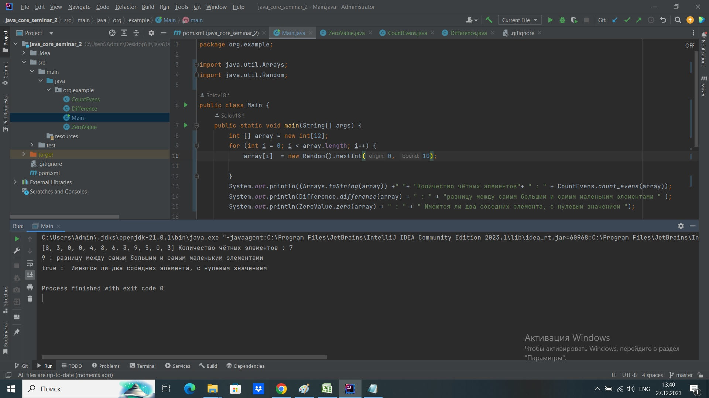

## Java Core (семинары)
# Урок 2. Данные и функции
Написать метод, возвращающий количество чётных элементов массива. countEvens([2, 1, 2, 3, 4]) → 3 countEvens([2, 2, 0]) → 3 countEvens([1, 3, 5]) → 0
Написать функцию, возвращающую разницу между самым большим и самым ма- леньким элементами переданного не пустого массива.
Написать функцию, возвращающую истину, если в переданном массиве есть два соседних элемента, с нулевым значением.

